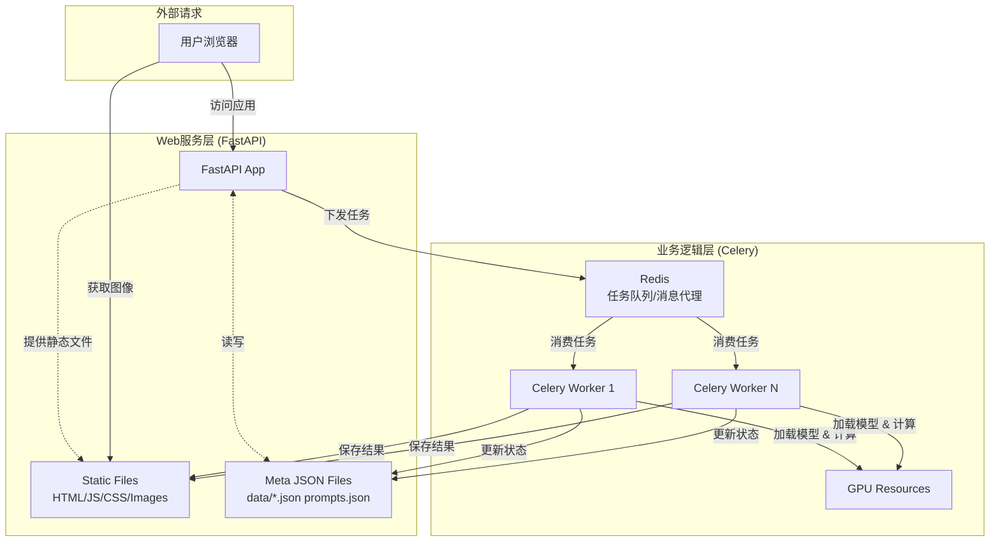

# **Golden Noise 数据采集系统 - 开发文档**

**版本:** 1.3
**状态:** 开发中
**日期:** 2025-08-20
**项目负责人:** [计算机视觉研究者]
**技术联系人:** [开发工程师]

## **1. 项目摘要**

本项目旨在构建一个基于Web的数据采集平台，用于支持扩散模型（Diffusion Models）的学术研究。核心功能是自动化生成大量“文本-图像”对，并通过人工评估筛选出每个文本提示（Prompt）对应的最佳图像及其初始噪声向量（`latent_vector`）。所有生成参数、结果和元数据将被完整记录，最终形成一个高质量、结构化的研究数据集。

**核心价值：**
*   **自动化流水线:** 集成模型推理、质量评估、人工标注流程。
*   **可复现性:** 精确记录每次实验的所有参数。
*   **灵活性:** 支持动态配置模型、采样参数和LoRA适配器。
*   **高性能:** 采用异步任务架构，确保Web响应与GPU计算分离。
*   **多模型支持:** 支持 Stable Diffusion 和 FLUX 模型。
*   **自动评分:** 集成 CLIP 和 HPSv2 图像-文本相似度评分系统。
*   **DrawBench支持:** 集成 DrawBench 基准测试数据集，用于评估和比较生成模型的性能。

## **2. 技术栈**

| 组件 | 技术选型 | 版本/备注 |
| :--- | :--- | :--- |
| **后端框架** | Python FastAPI | 主应用服务器 & API |
| **异步任务** | Celery | 分布式任务队列 |
| **消息代理** | Redis | 用作Celery的Broker和Backend |
| **深度学习** | PyTorch, HuggingFace Diffusers | >= 2.0, 需支持 `load_lora_weights` |
| **评分系统** | torchmetrics (CLIP score), HPSv2 | 图像-文本相似度评估 |
| **模型** | Stable Diffusion v1.5, FLUX.1-schnell, CLIP, HPSv2 | 其他模型需兼容Diffusers |
| **前端** | 原生 HTML, CSS, JavaScript | 无需前端框架 |
| **存储** | 本地文件系统 (NVMe SSD推荐) | 存储图像、向量、JSON元数据 |
| **部署** | Uvicorn, Redis-Server | 开发环境

## **3. 系统架构**



## **4. 数据模型与存储结构**

所有数据存储在本地文件系统，采用约定式结构。

### **4.1. 项目目录树**
```
project-root/
├── app.py                    # FastAPI应用入口
├── tasks.py                  # Celery任务定义
├── config.py                 # 应用配置（模型路径、默认参数）
├── drawbench_config.py       # DrawBench数据集配置
├── prompts.txt               # 初始Prompt列表（一行一个）
├── prompts.json              # 系统生成的Prompt索引文件
├── judgments.json            # （可选）全局标注记录
├── requirements.txt          # Python依赖列表
├── .env                      # 环境变量
│
├── static/                   # FastAPI静态文件目录
│   ├── js/                   # 前端JavaScript
│   ├── css/                  # 前端样式
│   ├── images/               # **存储所有生成图像**
│   │   └── {prompt_id}/
│   │       └── {seed}.jpg
│   ├── latents/              # **存储所有初始噪声向量**
│   │   └── {prompt_id}/
│   │       └── {seed}.npy
│   └── lora_models/          # **存储用户上传的LoRA文件**
│       └── {uploaded_name}.safetensors
│
└── data/                     # 存储元数据JSON文件
    ├── {prompt_id}.json      # 每个Prompt一个文件
    └── drawbench/            # DrawBench数据集目录
        └── {benchmark_name}/ # 每个基准测试一个目录
```

### **4.2. 核心JSON文件规范**

**1. 全局Prompt索引 (`prompts.json`)**
```json
[
  {
    "id": 1,
    "text": "a photo of an astronaut riding a horse on mars",
    "data_path": "data/1.json",
    "num_generations": 50,
    "num_judgments": 25,
    "golden_seed": 42,
    "created_at": "2024-06-07T10:00:00Z"
  }
]
```

**2. Prompt元数据文件 (`data/{id}.json`)**
```json
{
  "prompt_id": 1,
  "prompt_text": "a photo of an astronaut riding a horse on mars",
  "generation_config": { // **核心：生成时使用的完整参数配方**
    "model_name": "runwayml/stable-diffusion-v1-5",
    "num_inference_steps": 20,
    "guidance_scale": 7.5,
    "width": 512,
    "height": 512,
    "sampler_name": "Euler",
    "lora_config": [ // **LoRA配置列表，空数组=不加载**
      {
        "lora_name": "pixel_art_xl_v1.safetensors", // 存储在static/lora_models/下的文件名
        "lora_scale": 0.8 // 权重系数
      }
    ]
  },
  "generations": {
    "42": { // Key is the seed as string
      "seed": 42,
      "image_path": "static/images/1/42.jpg",
      "latent_path": "static/latents/1/42.npy",
      "clip_score": 0.301,
      "hpsv2_score": 0.721,
      "status": "completed", // "pending", "processing", "failed"
      "created_at": "2024-06-07T10:30:00Z"
    }
  },
  "judgments": [
    {
      "winner_seed": 42,
      "loser_seed": 999,
      "user_id": "researcher_1",
      "created_at": "2024-06-07T11:05:00Z"
    }
  ],
  "golden_seed": 42, // 被认定为Golden Noise的种子
  "locked": false // 标注是否完成
}
```

## **5. API 接口规范**

### **5.1. API设计原则**
1. **RESTful风格**: 所有API遵循REST规范，使用标准HTTP方法
2. **异步处理**: 长时间操作返回202 Accepted，通过任务ID跟踪状态
3. **一致性响应**:
   - 成功操作: 200 OK (GET), 201 Created (POST), 202 Accepted (异步任务)
   - 错误响应: 包含错误详情和解决建议
4. **版本控制**: 所有API路由前缀为`/api/`

### **5.2. 提示词管理**
*   **`GET /api/prompts`**
    *   **Desc:** 获取所有提示词列表及状态。
    *   **Res:** `200 OK` + `prompts.json` 内容。
*   **`POST /api/prompts/import`**
    *   **Desc:** 从 `prompts.txt` 初始化系统。
    *   **Res:** `200 OK` + `{"status": "imported", "count": N}`

### **5.4. DrawBench数据集管理**
*   **`GET /api/drawbench/benchmarks`**
    *   **Desc:** 获取所有可用的DrawBench基准测试名称和描述。
    *   **Res:** `200 OK` + 基准测试列表。
*   **`GET /api/drawbench/benchmark/{benchmark_name}`**
    *   **Desc:** 获取特定DrawBench基准测试的详细信息。
    *   **Res:** `200 OK` + 基准测试详细信息。
*   **`POST /api/drawbench/benchmark/{benchmark_name}/generate`**
    *   **Desc:** 为特定DrawBench基准测试生成图像。
    *   **Res:** `202 Accepted` + `{"status": "task_started"}`

### **5.2. 生成任务管理**
*   **`POST /api/prompts/{prompt_id}/generate`**
    *   **Desc:** 为指定Prompt发起批量生成任务。
    *   **Res:** `202 Accepted` + `{"status": "task_started"}`

### **5.3. DrawBench数据集管理**
*   **`GET /api/drawbench/benchmarks`**
    *   **Desc:** 获取所有可用的DrawBench基准测试名称和描述。
    *   **Res:** `200 OK` + 基准测试列表。
            "guidance_scale": 7.5,
            "lora_config": [...]
          }
        }
        ```
    *   **Res:** `202 Accepted` + `{"status": "task_started"}`

### **5.3. LoRA模型管理**
*   **`GET /api/loras`**
    *   **Desc:** 获取已上传的LoRA列表。
    *   **Res:** `200 OK` + `["lora1.safetensors", ...]`
*   **`POST /api/loras`**
    *   **Desc:** 上传LoRA文件。
    *   **Req:** `multipart/form-data`, 字段名 `lora_file`。
    *   **Res:** `201 Created` + `{"status": "uploaded", "filename": "..."}`
*   **`DELETE /api/loras/{lora_name}`**
    *   **Desc:** 删除指定LoRA文件。
    *   **Res:** `200 OK` or `404 Not Found`

### **5.4. 标注工作流**
*   **`GET /api/prompts/{prompt_id}/next_comparison`**
    *   **Desc:** 获取下一组待比较的图像对。
    *   **Res:** `200 OK` + `{"prompt_text": "...", "choice_a": {"seed": A, "image_url": "..."), "choice_b": {"seed": B, "image_url": "..."}}`
*   **`POST /api/judgments`**
    *   **Desc:** 提交一次人工判断。
    *   **Req Body (JSON):**
        ```json
        {
          "prompt_id": 1,
          "winner_seed": 42,
          "loser_seed": 999,
          "user_id": "researcher_1"
        }
        ```
    *   **Res:** `201 Created`

### **5.5. 数据与系统**
*   **`GET /api/stats`**
    *   **Desc:** 获取系统统计信息。
    *   **Res:** `200 OK` + `{"total_prompts": 100, "total_judgments": 500, ...}`
*   **`GET /api/export`**
    *   **Desc:** 导出Golden Noise数据集ZIP压缩包。
    *   **Res:** `application/zip` 文件流。

## **6. 前端界面规范**

### **6.1. 页面清单**
1.  **总览仪表盘 (`/`):** 系统进度、统计卡片、Prompt列表。
2.  **标注工作页 (`/judge.html`):** 核心交互界面，用于两两比较。
3.  **设置页面 (`/settings.html`):** 配置模型、采样器、LoRA等生成参数。
4.  **数据管理页 (`/data.html`):** 浏览、筛选、排序生成结果。

### **6.2. 标注页面 (`/judge.html`) 详细需求**
*   **布局:** 两栏式（Image A vs Image B），顶部显示Prompt和进度条，底部操作区。
*   **功能:**
    *   自动从 `next_comparison` API加载图像对。
    *   点击图像可放大预览。
    *   按钮: **“A更好” (1)**, **“B更好” (2)**, **“跳过” (Space)**。
    *   提交后自动加载下一组。
*   **UI:** 简洁，按钮大。选中图像时高亮（绿色边框）。实时显示进度（e.g., 15/50）。

### **6.3. 设置页面 (`/settings.html`) 详细需求**
*   **布局:** 标签页（Tabs）分组。
*   **标签页:**
    *   **基础:** 模型选择、宽高、步数、CFG尺度。
    *   **LoRA管理 (核心):**
        *   文件上传组件（拖拽/点击，仅 `.safetensors`）。
        *   已上传LoRA列表：显示文件名、**启用复选框**、权重滑块(0-2)、删除图标。
        *   *只有勾选的LoRA才会被加载。*
    *   **采样器:** 选择采样算法（Euler, DPM++等）。
*   **动作按钮:** `保存为默认`, `应用至新任务`。

## **7. Celery 任务实现**

**`tasks.py`** 中定义异步任务。

```python
# tasks.py
from celery import Celery
import torch
from diffusers import StableDiffusionPipeline, EulerDiscreteScheduler, FluxPipeline
import numpy as np
import json
import os
import fasteners  # 用于文件锁
from datetime import datetime
from torchmetrics.functional.multimodal import clip_score
import hpsv2
from PIL import Image
import tempfile

# 初始化Celery app
app = Celery('tasks', broker='redis://localhost:6379/0')

@app.task(acks_late=True, bind=True)
def generate_single_image(self, prompt_id: int, prompt_text: str, seed: int, generation_config: dict):
    """
    核心任务：生成单张图像并保存结果。
    参数:
        prompt_id: 提示词ID
        prompt_text: 提示词文本
        seed: 随机种子
        generation_config: 包含所有生成参数的字典
    """
    model_id = generation_config.get("model_name", "runwayml/stable-diffusion-v1-5")
    device = "cuda" if torch.cuda.is_available() else "cpu"
    
    try:
        # 1. 准备生成器与初始噪声
        generator = torch.Generator(device=device).manual_seed(seed)
        if "FLUX" in model_id.upper():
            latent_shape = (1, 16, 64, 64)  # FLUX
        else:
            latent_shape = (1, 4, 64, 64)  # SD v1.5
        init_latents = torch.randn(latent_shape, generator=generator, device=device, dtype=torch.float16)
        
        # 2. 加载模型管道
        if "FLUX" in model_id.upper():
            pipe = FluxPipeline.from_pretrained(model_id, torch_dtype=torch.float16)
        else:
            pipe = StableDiffusionPipeline.from_pretrained(model_id, torch_dtype=torch.float16)
        pipe.scheduler = EulerDiscreteScheduler.from_config(pipe.scheduler.config)  # 默认采样器，可从config覆盖
        pipe = pipe.to(device)
        
        # 3. 动态加载LoRA
        lora_configs = generation_config.get("lora_config", [])
        for lora_settings in lora_configs:
            lora_path = f"static/lora_models/{lora_settings['lora_name']}"
            lora_scale = lora_settings['lora_scale']
            pipe.load_lora_weights(lora_path)  # Diffusers官方方法
            # 注意: 某些版本可能需要 pipe.fuse_lora() 以获得性能提升
            
        # 4. 生成图像
        with torch.no_grad():
            image = pipe(
                prompt=prompt_text,
                num_inference_steps=generation_config.get("num_inference_steps", 20),
                guidance_scale=generation_config.get("guidance_scale", 7.5),
                width=generation_config.get("width", 1024),
                height=generation_config.get("height", 1024),
                generator=generator,
                latents=init_latents  # 传入初始噪声
            ).images[0]
        
        # 5. 保存输出
        image_filename = f"static/images/{prompt_id}/{seed}.jpg"
        latent_filename = f"static/latents/{prompt_id}/{seed}.npy"
        os.makedirs(os.path.dirname(image_filename), exist_ok=True)
        os.makedirs(os.path.dirname(latent_filename), exist_ok=True)
        
        image.save(image_filename)
        np.save(latent_filename, init_latents.cpu().numpy())
        
        # 6. 计算评估分数
        clip_score_val = calculate_clip_score(image, prompt_text)
        hps_score_val = calculate_hpsv2_score(image, prompt_text)
        
        # 7. 原子性更新元数据文件（使用文件锁）
        data_file_path = f"data/{prompt_id}.json"
        lock = fasteners.InterProcessLock(data_file_path + ".lock")
        with lock:
            with open(data_file_path, 'r+') as f:
                data = json.load(f)
                data['generations'][str(seed)] = {
                    "seed": seed,
                    "image_path": image_filename,
                    "latent_path": latent_filename,
                    "clip_score": clip_score_val,
                    "hpsv2_score": hps_score_val,
                    "status": "completed",
                    "created_at": datetime.now().isoformat()
                }
                f.seek(0)
                json.dump(data, f, indent=4)
                f.truncate()
        
        return {"status": "success", "seed": seed}
    
    except Exception as e:
        # 错误处理：更新状态为failed
        # ... (类似上面的锁机制更新JSON) ...
        raise self.retry(exc=e, countdown=60, max_retries=3)  # 失败重试3次

def calculate_clip_score(image, prompt_text):
    """
    使用torchmetrics的CLIP score计算图像和文本的相似度
    Args:
        image: PIL图像对象或图像路径
        prompt_text: 文本提示
    
    Returns:
        CLIP score (0-1)
    """
    # 确保输入是PIL图像
    if isinstance(image, str):
        image = Image.open(image).convert("RGB")
    elif not isinstance(image, Image.Image):
        raise ValueError("image参数必须是PIL图像对象或图像路径")
    
    # 将图像转换为tensor
    image_tensor = torch.tensor(np.array(image)).permute(2, 0, 1).unsqueeze(0).float()  # HWC -> CHW并添加batch维度
    
    # 计算CLIP score
    score = clip_score(image_tensor, prompt_text)
    
    # 转换为0-1范围 (CLIP score返回的是-1到1之间的值)
    normalized_score = (score + 1) / 2
    
    return float(normalized_score)

def calculate_hpsv2_score(image, prompt_text):
    """
    计算HPSv2分数
    Args:
        image: PIL图像对象或图像路径
        prompt_text: 文本提示
    
    Returns:
        HPSv2分数 (0-100)
    """
    # HPSv2评估需要图像路径和文本
    if isinstance(image, Image.Image):
        # 如果是PIL图像对象，保存到临时文件
        with tempfile.NamedTemporaryFile(suffix=".jpg", delete=False) as tmpfile:
            image.save(tmpfile.name)
            image_path = tmpfile.name
    elif isinstance(image, str):
        image_path = image
    else:
        raise ValueError("image参数必须是PIL图像对象或图像路径")
    
    # HPSv2评估
    score = hpsv2.score(image_path, prompt_text)
    
    # 如果使用了临时文件，删除它
    if 'tmpfile' in locals():
        os.unlink(tmpfile.name)
    
    return float(score[0]) if isinstance(score, list) else float(score)

## **7.5. 日志系统实现**

### **7.5.1. 后端日志**
- **日志配置**:
  - 文件日志: `logs/backend.log`
  - 控制台日志
  - 格式: `时间戳 - 日志级别 - 消息`
- **日志级别**:
  - INFO: 常规操作记录
  - ERROR: 错误和异常
- **关键日志点**:
  - API请求处理
  - 任务执行状态
  - 系统错误

### **7.5.2. 前端日志**
- **日志格式**:
  - 结构化JSON格式
  - 包含时间戳、操作类型、用户上下文
- **日志内容**:
  - 用户交互
  - API调用
  - 错误信息
- **日志传输**:
  - 控制台日志
  - 可选后端API日志收集

### **7.5.3. 日志管理**
- 自动创建`logs`目录
- 日志轮转支持
- 敏感信息过滤

## **8. 部署与运行指南**

### **8.1. 环境设置**
```bash
# 1. 创建并激活虚拟环境
python -m venv venv
source venv/bin/activate  # Linux/macOS
# .\venv\Scripts\activate  # Windows

# 2. 安装依赖
pip install -r requirements.txt
# requirements.txt 应包含:
# fastapi uvicorn celery redis torch diffusers transformers accelerate numpy fasteners python-multipart
```

### **8.2. 配置文件 (`.env`)**
```
# 模型路径
MODEL_ID=runwayml/stable-diffusion-v1-5
# 消息队列
REDIS_URL=redis://localhost:6379/0
# 其他配置
HPS_MODEL_PATH=./models/hps_v2_compressed.pt
```

### **8.3. 启动服务**
**需要三个独立的终端：**

```bash
# 终端 1: 启动Redis服务器
redis-server

# 终端 2: 启动Celery Worker
celery -A tasks worker --loglevel=info --pool=solo -c 1
# 生产环境可使用: --pool=gevent -c 4

# 终端 3: 启动FastAPI应用
uvicorn app:app --reload --host 0.0.0.0 --port 8000
```
**访问应用:** `http://localhost:8000`

## **9. 开发进度与注意事项**

### **9.1. 当前开发状态**
- **已完成**:
  - [x] 核心API实现 (提示词/生成/评分)
  - [x] Celery任务队列集成
  - [x] 多模型支持架构
  - [x] 自动评分系统集成
  - [x] 基础前端界面框架

- **进行中**:
  - [ ] DrawBench数据集完整集成
  - [ ] LoRA管理界面开发
  - [x] 标注工作流优化 (已集成到settings.html)

- **待开发**:
  - [ ] 数据导出功能
  - [ ] 生产环境安全加固
  - [ ] 性能监控仪表盘
  - [ ] 用户认证系统开发

### **9.2. 注意事项**
1. **文件锁:** 使用 `fasteners` 库确保多Celery Worker同时写同一个 `data/{id}.json` 文件时的数据一致性。
2.  **CUDA & 内存:** 在开发环境中，Celery Worker使用 `--pool=solo -c 1` 以避免多进程共享CUDA上下文问题。
3.  **错误处理:** 任务中需包含健全的异常捕获和重试机制。
4.  **安全性:** 当前为内网研究工具，未设身份验证。如需对外开放，必须添加安全措施（如JWT认证）。
5.  **性能监控:** 建议部署 `flower` 来监控Celery任务： `celery -A tasks flower`。
