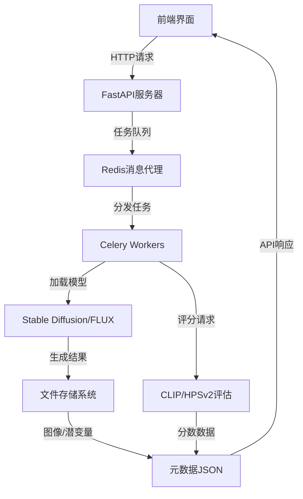

# Golden Noise 数据采集系统

## 项目简介

Golden Noise 是一个基于Web的数据采集平台，用于支持扩散模型（Diffusion Models）的学术研究。核心功能是自动化生成大量“文本-图像”对，并通过人工评估筛选出每个文本提示（Prompt）对应的最佳图像及其初始噪声向量（`latent_vector`）。所有生成参数、结果和元数据将被完整记录，最终形成一个高质量、结构化的研究数据集。

## 核心特性

- **自动化流水线**: 集成模型推理、质量评估、人工标注流程。
- **可复现性**: 精确记录每次实验的所有参数。
- **灵活性**: 支持动态配置模型、采样参数和LoRA适配器。
- **高性能**: 采用异步任务架构，确保Web响应与GPU计算分离。
- **支持多种模型**: 包括 Stable Diffusion 和 FLUX 模型。
- **集成评分系统**: 使用 CLIP 和 HPSv2 对生成的图像进行自动评分。
- **DrawBench 数据集支持**: 包含多个基准测试，用于评估和比较生成模型的性能。

## 技术栈

| 组件 | 技术选型 | 版本/备注 |
## 系统架构



## 技术栈

| 组件 | 技术选型 | 版本/备注 |
| :--- | :--- | :--- |
| **后端框架** | Python FastAPI | 主应用服务器 & API |
| **异步任务** | Celery | 分布式任务队列 |
| **消息代理** | Redis | 用作Celery的Broker和Backend |
| **深度学习** | PyTorch, HuggingFace Diffusers | >= 2.0, 需支持 `load_lora_weights` |
| **评分系统** | torchmetrics (CLIP score), HPSv2 | 图像-文本相似度评估 |
| **模型** | Stable Diffusion v1.5, FLUX.1-schnell, CLIP, HPSv2 | 其他模型需兼容Diffusers |
| **前端** | 原生 HTML, CSS, JavaScript | 无需前端框架 |
| **存储** | 本地文件系统 (NVMe SSD推荐) | 存储图像、向量、JSON元数据 |
| **部署** | Uvicorn, Redis-Server | 开发环境 |

## 项目结构

```
project-root/
├── app.py                    # FastAPI应用入口
├── tasks.py                  # Celery任务定义
├── config.py                 # 应用配置（模型路径、默认参数）
├── drawbench_config.py       # DrawBench数据集配置
├── prompts.txt               # 初始Prompt列表（一行一个）
├── prompts.json              # 系统生成的Prompt索引文件
├── judgments.json            # （可选）全局标注记录
├── requirements.txt          # Python依赖列表
├── .env                      # 环境变量
│
├── static/                   # FastAPI静态文件目录
│   ├── js/                   # 前端JavaScript
│   ├── css/                  # 前端样式
│   ├── images/               # **存储所有生成图像**
│   │   └── {prompt_id}/
│   │       └── {seed}.jpg
│   ├── latents/              # **存储所有初始噪声向量**
│   │   └── {prompt_id}/
│   │       └── {seed}.npy
│   └── lora_models/          # **存储用户上传的LoRA文件**
│       └── {uploaded_name}.safetensors
│
└── data/                     # 存储元数据JSON文件
    └── {prompt_id}.json      # 每个Prompt一个文件
    └── drawbench/            # DrawBench数据集目录
        └── {benchmark_name}/ # 每个基准测试一个目录
```

## 快速开始

### 系统管理脚本
我们提供了一个便捷的管理脚本`manage_system.sh`来简化服务管理:

```bash
# 赋予执行权限
chmod +x manage_system.sh

# 运行管理脚本
./manage_system.sh

# 或者直接运行特定命令
./manage_system.sh start   # 启动所有服务
./manage_system.sh stop    # 停止所有服务
./manage_system.sh restart # 重启所有服务
./manage_system.sh status  # 查看服务状态
```

脚本提供交互式菜单，支持以下功能:
1. 查看服务状态
2. 启动所有服务  
3. 停止所有服务
4. 重启所有服务
5. 退出

### 1. 安装依赖

```bash
pip install -r requirements.txt
```

### 2. Redis安装与配置

#### Linux (Ubuntu/Debian) 安装
```bash
sudo apt update
sudo apt install redis-server
```

#### 启动Redis服务
```bash
sudo systemctl enable redis-server
sudo service redis-server start
```

#### 验证Redis运行状态
```bash
redis-cli ping  # 应该返回 "PONG"
```

#### 基本配置调整
vim `/etc/redis/redis.conf`:
```conf
# 如果需要远程访问 (仅限开发环境)
# bind 127.0.0.1 ::1
# protected-mode no

# 内存限制 (根据实际情况调整)
maxmemory 2gb
maxmemory-policy allkeys-lru
```

#### 常见问题解决
1. **端口占用**: 检查6379端口是否被占用 `sudo lsof -i :6379`
2. **内存不足**: 调整`maxmemory`设置或清理现有缓存 `redis-cli FLUSHALL`
3. **连接问题**: 确保防火墙允许6379端口 `sudo ufw allow 6379`

### 3. 启动Redis服务器

```bash
redis-server
```

### 3. 启动Celery Worker

```bash
celery -A tasks worker --loglevel=info --pool=solo -c 1
```

### 4. 启动FastAPI应用

```bash
uvicorn app:app --reload --host 0.0.0.0 --port 8000
```

## API 接口

### 提示词管理
* **`GET /api/prompts`**
  * **Desc:** 获取所有提示词列表及状态。
  * **Res:** `200 OK` + `prompts.json` 内容。
* **`POST /api/prompts/import`**
  * **Desc:** 从 `prompts.txt` 初始化系统。
  * **Res:** `200 OK` + `{"status": "imported", "count": N}`

### 生成任务管理
* **`POST /api/prompts/{prompt_id}/generate`**
  * **Desc:** 为指定Prompt发起批量生成任务。
  * **Req Body (JSON):**
      ```json
      {
        "num_seeds": 50,
        "generation_config": { // 完整参数集，见数据模型部分
          "model_name": "...",
          "guidance_scale": 7.5,
          "lora_config": [...]
        }
      }
      ```
  * **Res:** `202 Accepted` + `{"status": "task_started"}`

### DrawBench数据集管理
* **`GET /api/drawbench/benchmarks`**
  * **Desc:** 获取所有可用的DrawBench基准测试名称和描述。
  * **Res:** `200 OK` + 基准测试列表。
* **`GET /api/drawbench/benchmark/{benchmark_name}`**
  * **Desc:** 获取特定DrawBench基准测试的详细信息。
  * **Res:** `200 OK` + 基准测试详细信息。
* **`POST /api/drawbench/benchmark/{benchmark_name}/generate`**
  * **Desc:** 为特定DrawBench基准测试生成图像。
  * **Res:** `202 Accepted` + `{"status": "task_started"}`

## 开发文档

详细的开发文档请参见 [Dev.md](Dev.md)。

## 当前开发状态

### 已完成功能
- [x] 项目基础架构搭建
- [x] FastAPI应用基础实现
- [x] Celery异步任务系统
- [x] 模型兼容性支持（Stable Diffusion和FLUX）
- [x] 图像生成和存储系统
- [x] CLIP和HPSv2自动评分系统
- [x] DrawBench数据集配置和API接口
- [x] 评估界面开发 (judge.html)
  - 图像对比功能
  - 评分系统
  - 进度跟踪
- [x] 设置页面集成评估功能 (settings.html)
  - 图像对比界面
  - 键盘快捷键支持(1/2选择，空格提交，S跳过)
- [x] 日志系统实现
  - 前后端操作日志
  - 错误跟踪

### 待开发功能
- [ ] 系统设置界面 (settings.html)
- [ ] 完整实现DrawBench数据集下载功能
- [ ] 完善图像生成任务的触发和管理
- [ ] 实现LoRA模型的上传和管理界面
- [ ] 创建标注工作流的前端界面
- [ ] 实现数据导出和统计功能
- [ ] 添加身份验证和安全措施（用于生产环境）
- [ ] 创建数据库迁移和升级脚本
